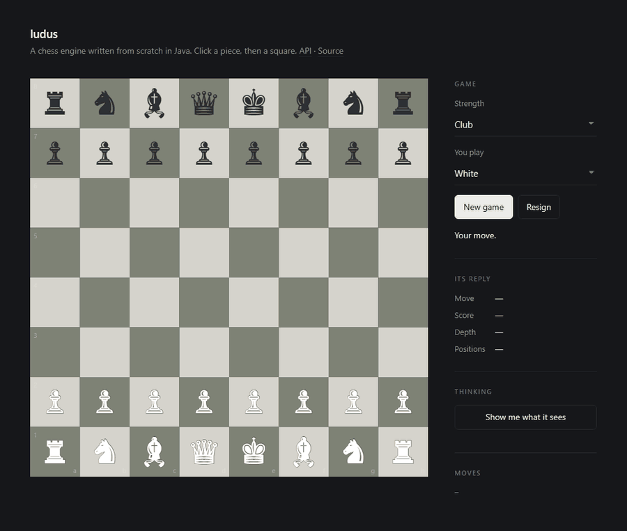
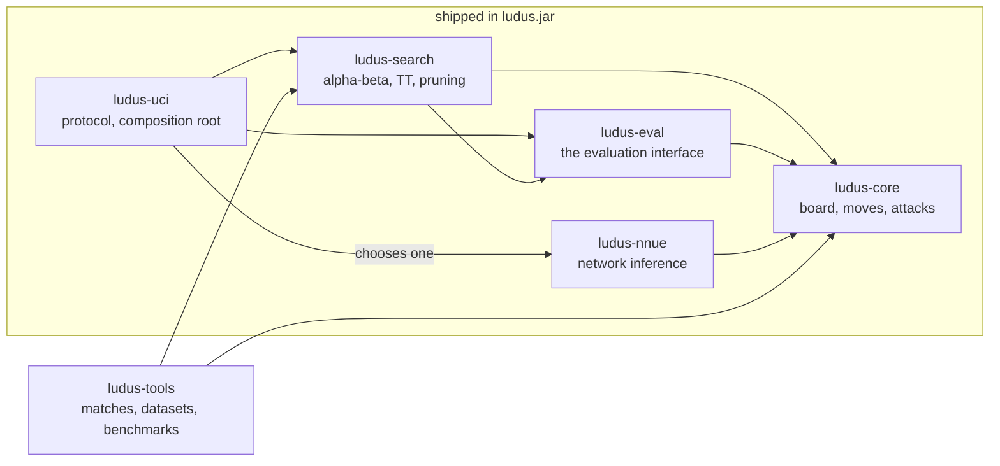

# ludus

[](https://github.com/LorenzoVicino/ludus/actions/workflows/ci.yml)

**A chess engine written in Java, from scratch.**

An engine is the part of a chess program that decides what to play. It has no board and no windows of
its own: it is a program that reads a position on standard input and writes back a move. You point an
existing chess application at it — Cute Chess, Arena, En Croissant — and play against it there, the way
a car takes an engine.

```
$ java -jar ludus-uci/target/ludus.jar
uci
position startpos moves e2e4 e7e5
go movetime 1000
info depth 9 score cp 24 nodes 1284551 nps 1284551 pv g1f3 b8c6 f1b5
bestmove g1f3
```

That is the whole interface. The rest of this file explains what is behind it, and why the project is
shaped the way it is.

**[Download the engine](https://github.com/LorenzoVicino/ludus/releases/latest)** — one jar, no
dependencies, JDK 24. Or build it from source below.

## Playing it in a browser

There is also an HTTP service, so the engine can be played from a web page instead of a chess program:



The column on the right is the engine's own reporting, not decoration: the move it chose, how it scored
the position, how deep it managed to look and how many positions that took. Underneath, the search streams
in **as it happens** — iterative deepening means a complete answer at depth 1, then a better one at depth
2, and watching the line get rewritten as it sees further is the clearest sign that something is being
searched rather than looked up.

```bash
docker compose --profile demo up -d
```

That is the whole thing — it builds the service from source, starts Postgres, runs the migrations and
waits for the database to be ready first. Then open **http://localhost:8080** for the board, or
**/swagger-ui.html** for the API. `docker compose --profile demo down` when you are done.

To develop against it instead, with the service running from an IDE or the command line:

```bash
docker compose up -d                      # Postgres only
./mvnw -pl ludus-server -am -DskipTests package
java -jar ludus-server/target/ludus-server-0.2.0-SNAPSHOT.jar
```

`spring-boot:run` works too, but needs the plugin's full coordinates from the root of a multi-module
build — the short prefix is resolved against the top-level project, which does not declare it:

```bash
./mvnw -pl ludus-server -am org.springframework.boot:spring-boot-maven-plugin:run
```

```
POST   /api/games                 start one; 201 with its location
GET    /api/games/{id}            the position, and every move legal right now
POST   /api/games/{id}/moves      your move; the engine's reply comes back with it
GET    /api/games/{id}/analysis   server-sent events: the search, as it thinks
DELETE /api/games/{id}            resign
```

A game is a URL — `/?game=<id>` — so one can be shared, bookmarked or reloaded, and what the engine thought
about its last move comes back with it rather than being lost on refresh.

That is also why the animation above can be regenerated rather than re-recorded by hand: the script plays a
game through the API and photographs the page after each move, so the README stops going stale the moment
the design changes.

```bash
pwsh tools/capture-readme-gif.ps1
```

The service is a separate module that depends on the engine **the way the tooling does**. Nothing under
`ludus-core` or `ludus-search` knows a web server exists, the module graph makes referring to it from
there a compile error, and Spring's dependency tree is imported in that module's POM rather than the
parent's — so the jar a chess GUI launches still has no third-party dependencies at all.

---

## What a chess engine actually does

Two things, and keeping them separate is most of the design.

**It looks ahead.** From the position in front of it, it tries a move, then every reply, then every
reply to that, as deep as the clock allows. The tree grows about thirty-five times per level, so brute
force runs out immediately and almost all the work is in *not* searching: proving that a whole branch
cannot matter, and abandoning it. That part is called **search**.

**It judges positions.** The search has to stop somewhere, and at the bottom something must answer
"who is better here, and by how much?" — in centipawns, hundredths of a pawn. That part is called
**evaluation**, and it is where the chess knowledge lives.

The two are independent in a way that is easy to state and hard to keep: search does not need to know
*how* a position is judged, only that some function will judge it. In this repository the search
literally cannot name the network that judges positions — the module graph makes that a compilation
error rather than a matter of discipline. That seam was cut on the first day, before there was anything
to put on the other side of it.

---

## Two acts

The evaluation is built twice, deliberately.

**Act I is written by hand.** Rules a human can state: a queen is worth about nine pawns, a knight on
the rim is worse than one in the centre, doubled pawns are a liability, a king should hide behind its
pawns early and march to the centre once the pieces are gone. Explicit, readable, and limited by what
somebody thought to write down.

**Act II is learned.** A small neural network — an **NNUE**, the architecture modern engines use — is
trained on positions the engine generates by playing itself, and replaces the hand-written function
without a single line of the search changing.

The order matters. Act I is what Act II is measured against: without a working engine first, "the
network is good" has nothing to mean. It also means the interesting question is not "does the network
work" but "does it beat the thing it replaced", which is a question with an answer.

The network is a couple of hundred thousand small integers, and evaluating it has to happen millions of
times per second. Two ideas make that possible, and both are why NNUE looks the way it does:

- **The input is sparse and the change is tiny.** A position is described by which piece stands on
  which square — 768 possible facts, of which at most 32 are true. Moving one piece changes two of
  them. So the first layer's output is not recomputed; it is carried along and *adjusted*, two columns
  added and two subtracted. That is the "incrementally updated accumulator", and it is the whole trick.
- **It runs in integers.** Weights are quantised to bytes and shorts, which is fast and lossy, and the
  loss is a real engineering problem rather than a footnote — the repository checks the integer engine
  against the floating-point trainer position by position, because a network that is quietly a coarse
  copy of the one that was trained plays worse for no visible reason.

---

## Why chess, and not something more useful

Because chess is one of the few domains where you can find out whether you are right, and most software
is not like that.

### Correctness has an oracle

From the starting position there are exactly **197,281** legal games four moves long. Not about that —
exactly that. The counts are published for a set of standard positions, and a program that generates
moves can be pointed at them:

```bash
./mvnw test -Pslow    # every published count, roughly 600 million positions
```

If it answers 197,280, there is a bug. Not "possibly" — a bug, and the count can be broken down per
first move to say which branch to look in. Most programs have nothing like this: you write something,
it seems to work, and "seems" is all you ever get.

### Strength has an oracle too

"This change made the engine better" is exactly the kind of claim that feels obvious and is often
false. So no change to search or evaluation is kept on the strength of how sensible it reads. The new
version plays several hundred games against the old one, and statistics decide whether the difference
is real:

```bash
java -jar ludus-tools/target/ludus-match.jar local \
    --engine-a "java -jar build/candidate.jar" \
    --engine-b "java -jar build/baseline.jar" \
    --pairs 250 --movetime 100 --sprt 0 10
```

Two details that are not decoration. Each opening is played **twice with the colours swapped**, because
otherwise the match partly measures who drew White more often. And the test is an **SPRT** — a
sequential test that stops as soon as the evidence is one-sided, which is what makes measuring every
change affordable rather than a thing you promise to do later.

It reports a verdict as an exit code, so a change can be gated on it without a human reading the
output: `0` accepted, `1` rejected, `2` no decision.

The rule is that a rejected change does not land, however good the code is. Changes have been rejected.
`DESIGN.md` records them next to the reasoning that predicted otherwise, because those are the entries
worth reading.

---

## How the code is laid out



`ludus-search` depends on `ludus-eval`, the *interface*, and not on `ludus-nnue`, the network. So the
search cannot accidentally learn which evaluation it is using; only `ludus-uci`, the composition root,
knows. **The arrow that is missing is the design.**

`ludus-tools` is development tooling — it runs matches, generates training data and measures things —
and never ships inside the engine. That is what keeps the engine itself free of third-party
dependencies: it is a subprocess a GUI starts in milliseconds, and it has no business carrying a
message broker into that.

---

## Building and running

JDK 24 is the only prerequisite; the Maven wrapper fetches Maven itself.

```bash
./mvnw verify          # build plus the fast test suite
./mvnw test -Pslow     # deep perft counts and a full self-play game
```

The split keeps the gating build quick. The slow suite counts hundreds of millions of positions, so it
runs nightly and on demand rather than on every push.

`./mvnw package` produces `ludus-uci/target/ludus.jar`, one self-contained file. Any UCI host takes
`java -jar ludus-uci/target/ludus.jar` as an engine definition.

Driving it by hand is the quickest way to watch it think, and one thing is worth watching for. Ask it
about a position in the middle of an exchange and see whether the score settles as the depth climbs:

```
without quiescence:  depth 1  cp  25    depth 2  cp -140    depth 3  cp  50
with quiescence:     depth 1  cp  25    depth 2  cp   -5    depth 3  cp  15
```

Swings of ±165 centipawns become ±30. Without quiescence the engine judges positions mid-exchange: at
odd depths it has taken the last piece, at even depths its opponent has, and the score lurches. Chasing
captures to a quiet position before judging removes the illusion, and it is the single largest gain in
the project.

---

## The tooling

```bash
# generate training positions on this machine, no infrastructure
java -jar ludus-tools/target/ludus-match.jar collect --local \
    --samples 700000 --depth 10 --endgame-fraction 0.35 --out build/selfplay.txt

# or spread generation and matches over several machines, with RabbitMQ between them
docker compose --profile tooling up -d
java -jar ludus-tools/target/ludus-match.jar collect --samples 2000000
java -jar ludus-tools/target/ludus-match.jar generate --concurrency 6   # on each machine

# how fast the search runs, which is a different question from how well it plays
java -jar ludus-tools/target/ludus-match.jar bench --depth 8
```

Two notes on generating data, because both are less obvious than they look.

**Endgames have to be constructed, not played into.** An engine playing itself ends in the middlegame
or by the fifty-move rule; it almost never reaches a real king-and-pawn ending. A dataset built only
from openings is therefore thin exactly where the evaluation behaves least like its middlegame self, so
endgame positions are placed on the board directly and played from there.

**The queue steers, rather than handing out a fixed list.** Jobs are refilled with whichever kind of
position the dataset is currently short of. Publishing the whole run up front fixes its composition in
advance and gets it wrong, because an endgame searches roughly ten times faster than a middlegame and a
fixed share of *jobs* is not a fixed share of *positions*. A plain loop cannot steer work it has
already handed out; that is what the broker is there for, along with surviving a machine dying
mid-job.

A workflow also publishes a page with the current measurements, at
[lorenzovicino.github.io/ludus](https://lorenzovicino.github.io/ludus/), written by the build rather
than by hand.

---

### Putting it on the internet

`fly.toml` deploys it, and the settings in it are the interesting part rather than the command. Three
things are true of a public instance that are not true of one on a laptop:

**One caller must not be able to take the whole machine.** The engine pool already bounds how many searches
run at once, but not how many one client may ask for in a row — and a search is *seconds* of a core. So the
expensive endpoints get a much smaller allowance than the cheap ones: reading a position is a database row,
asking the engine to think is CPU nobody else can use. Refusals come back as **429 with a `Retry-After`**,
because "try later" without a number is not information. The limit is off by default, since on a laptop it
only obstructs whoever is testing.

**Games have to expire.** Starting one costs no account and no confirmation, which is what makes it
pleasant to try and also means the table grows for as long as the service is up — and anything public gets
crawled. Untouched games are swept after a fortnight: long enough that a shared link works tomorrow. There
is nothing to anonymise first, because a game holds a starting position and a list of moves and nothing
about who played it.

**Metrics are for whoever runs it, not whoever visits.** All the management endpoints moved to their own
port, and only 8080 is published. They carry no secrets, but they do describe the machine — pool size,
heap, timings, whether the database is reachable — and an endpoint nobody needs publicly should not be
publicly reachable.

Two honest costs of the free tier, stated because they are real. The machine **stops when nobody is
playing**, so the first move after a quiet spell waits several seconds for a JVM to start. And a shared CPU
plays *weaker* chess rather than slower chess — which is deliberate: the difficulty levels are capped by
time as well as by depth, so a slow machine produces a shallower search rather than a request that hangs.

## The decisions in the web service

A chess engine turns out to be an awkward thing to put behind HTTP, in ways that make the service more
interesting than a CRUD API. Four of them:

**A search is stateful, single-threaded, and expensive to create.** It owns a transposition table, killer
tables, history counters and preallocated move lists for every ply — megabytes of arrays that exist so
the search never allocates while running. Two requests sharing one instance would corrupt each other's
tables and return legal-looking wrong moves; building one per request would throw all that away between
moves. So there is a **fixed pool**, borrowed and returned, sized to *cores minus one* because search is
CPU-bound and a saturated machine makes even the cheap requests slow. A request that cannot get an engine
inside its timeout is refused with **503 and a `Retry-After`**, rather than queued behind clients who
have already left.

**A search takes seconds, and a database transaction must not.** So the sequence is: read the game,
validate the move in memory, *let go of the connection*, search, then write once. Correctness across that
gap comes from an optimistic-locking version column rather than a lock — if another request moved
meanwhile, the write fails and the answer is **409**, because the move was computed for a position that no
longer exists. Holding a pooled connection while a core grinds through a search tree would exhaust the
connection pool before the engine pool, which looks like a database problem and is not one.

**Games are stored as their moves, not their position.** A draw by repetition needs to know which
positions have occurred and the fifty-move counter needs the history that produced it; a stored FEN has
forgotten both. Replaying costs microseconds and is the only version that gets the rules right.

**The engine was already streaming.** It has had a `SearchListener` since the first milestone, to emit the
`info` lines UCI requires. The server-sent-events endpoint subscribes to that same callback and forwards
it — no engine code changed to make watching the search possible, which is the practical payoff of having
cut the interface early rather than when it became useful.

Errors are all [RFC 9457](https://www.rfc-editor.org/rfc/rfc9457) problem documents, and they try to say
what *would* have worked: an illegal move comes back **422** with the legal moves attached, because the
server generated them in order to decide and throwing them away would only make the client guess.

## Why Java

Serious engines are written in C++ or Rust, which makes the JVM the interesting part rather than a
handicap. Some of what the constraint forces:

- **Zero allocation in the search.** No objects in a loop running millions of times a second: moves are
  packed into `int`s, move lists are preallocated per ply, and the allocation rate during a long search
  is verified flat with JFR.
- **The transposition table as parallel primitive arrays.** An array of entry *objects* costs a second
  cache miss per lookup plus an object header per entry; two `long[]` do not.
- **No `PEXT`.** BMI2's parallel bit extract is not portably reachable from Java, so sliding-piece
  attacks use magic bitboards.
- **The Vector API** for network inference, with a tested scalar fallback kept as the correctness
  reference — and kept because the incubator module has to be requested on the command line, which no
  GUI does.

---

## Where the reasoning is

[`DESIGN.md`](DESIGN.md) is the working design record: the architecture, the measurement strategy, and
every place the implementation departed from the plan, recorded next to the original reasoning rather
than edited out. The wrong turns are in there deliberately, including several where a number was quoted
confidently and turned out to be an artefact of how it was measured. A design document that stops tracking
reality stops being worth reading.

[`CONTRIBUTING.md`](CONTRIBUTING.md) is the short version of the rules that record follows: move generation
stays exact, strength is measured rather than argued, one patch at a time, and `main` is reached through a
pull request.

## License

MIT — see [`LICENSE`](LICENSE). All code is original.
