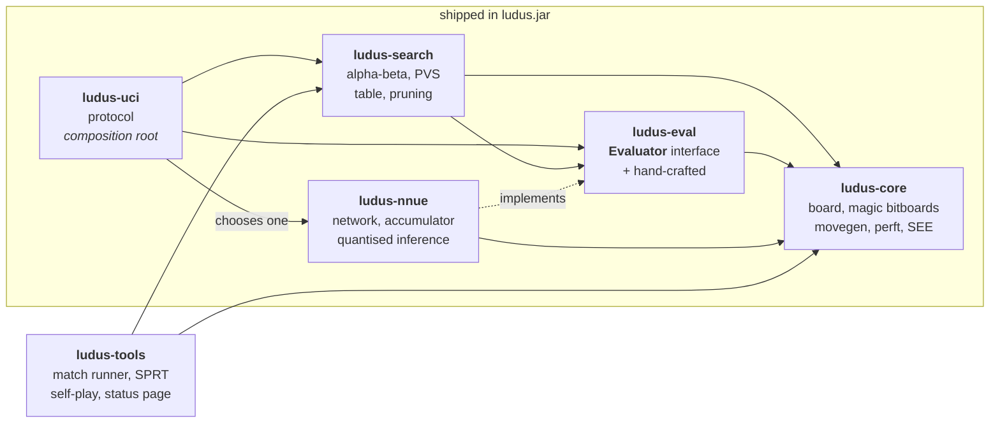
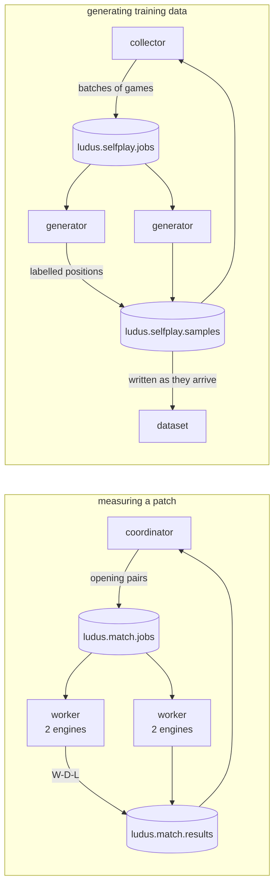

# ludus

[](https://github.com/LorenzoVicino/ludus/actions/workflows/ci.yml)
[](https://lorenzovicino.github.io/ludus/)

**[Live status → lorenzovicino.github.io/ludus](https://lorenzovicino.github.io/ludus/)** — measured
Elo, the milestone ladder, and every perft position recomputed on each run. Written by the build.

A UCI chess engine written in Java, built in two acts: first a classical engine with a
hand-crafted evaluation, then an NNUE — a small neural network evaluation with an
incrementally updated accumulator — replacing it.

**Status: M3 complete.**

> **+182 ± 40 Elo** over M2, from 195 wins, 54 draws and 51 losses across 300 games.
> The SPRT crossed its bound at game 85.

The engine speaks UCI, loads into any chess GUI as a single jar, and searches with quiescence, a
transposition table, killers and history, principal variation search, null move pruning and late
move reductions. Move generation is magic bitboard based and validated by the full perft suite.

M3 was three patches and three separate SPRT matches, and **the first one was rejected** — which is
the whole reason for measuring them one at a time. Null move pruning came out at −16 ± 36 Elo,
because it was inert: its guard correctly refused to fire on wide search windows, and the engine had
no narrow ones until principal variation search created them. Shipped without measurement, it would
have been a feature that did nothing. The full account is in [`DESIGN.md`](DESIGN.md) §9.0.

**Act II is built, and losing for a measurable reason.** The network runs — the accumulator matches a
full recomputation bit for bit over 73,862 positions, and the engine reproduces PyTorch's own answer
to within 4 centipawns — but the first trained network lost to the hand-crafted evaluation by
**−589 ± 147 Elo**, so it is not the default.

The obvious explanation was too little training data. The benchmark said otherwise:

```
hand-crafted        depth 8   2,160,818 nodes    346 ms   6,245,138 nodes/s
network             depth 8   3,097,290 nodes   9421 ms     328,764 nodes/s
```

**Nineteen times slower** — two to three plies of depth given up before the network's opinion matters
at all. That reorders the remaining work: making inference fast is now a prerequisite for the network
being worth training further, not a follow-on. [`DESIGN.md`](DESIGN.md) §9.05 has the account.

Two measurements made that call rather than a guess. The agreement test separates "the network is
weak" from "the engine runs it wrongly"; the benchmark separates "searches worse" from "searches
slower". Without either, the plausible story would have been believed and weeks of generating
positions would have bought nothing.

The architecture, the measurement strategy and the milestone plan are in [`DESIGN.md`](DESIGN.md).

## Architecture



**The arrow that is missing is the design.** There is no edge from `ludus-search` to `ludus-nnue`,
and there never will be: the search depends on an interface, and the only module that knows which
implementation exists is the one at the top. Swapping a hand-written evaluation for a neural network
changes one line in the composition root and not a character of the search.

That boundary was drawn in M1, months before there was anything to put behind it, and it has not
moved since. It is also enforced rather than agreed: calling network code from the search is a
compile error, not a code-review comment.

`ludus-tools` sits outside the shipped jar. It is the only place with a third-party dependency, which
is how the engine a GUI launches has none at all.

## Why two acts

Act I is a conventional engine: bitboards, magic bitboard move generation, alpha-beta search
with a transposition table, and an evaluation function written by hand.

Act II replaces that evaluation with an NNUE, the technique that gained Stockfish several
hundred Elo in 2020. The network is small, quantised to integers, and its first layer is
updated incrementally as moves are made and unmade rather than recomputed from scratch.

The point of splitting it this way is that the machine learning work has an **honest metric**.
Act II is not "a project that uses a neural network" — it is a measured Elo delta between two
versions of the same engine, established by an SPRT match. Most ML side projects report an
accuracy figure on a dataset that means nothing outside that dataset. This one reports whether
the engine actually got stronger.

The architecture is designed so Act II is a plug-in and not a rewrite: the evaluation sits
behind an interface with `onMakeMove` / `onUnmakeMove` hooks from day one, so the NNUE can
maintain its accumulator without the search ever knowing it exists.

## Correctness and strength are measured, not asserted

Two oracles do the work, and both exist before the code they validate:

**Perft** counts the leaves of the legal move tree at a given depth. The counts for standard
positions are published, so a mismatch is proof of a move generation bug — and per-move
counts at the root point at the branch containing it. It is a debugger, not just a test.

**SPRT** decides whether a change actually helped. Every search or evaluation patch plays a
match against the previous version under a sequential probability ratio test; if the test does
not pass, the patch does not land. One patch at a time, so a regression is always attributable.

The match runner lives in `ludus-tools` rather than being an external program, and reports its
verdict as an exit code — 0 accepted, 1 rejected, 2 inconclusive — so CI can gate a patch on the
result instead of on somebody reading the output:

```bash
java -jar ludus-tools/target/ludus-match.jar \
    --engine-a "java -jar build/candidate.jar" \
    --engine-b "java -jar build/baseline.jar" \
    --book build/openings.epd \
    --pairs 100 --movetime 100 --concurrency 8 --sprt 0 10
```

It plays every opening twice with the colours swapped, since otherwise a match measures the
opening book as much as the engines. Time is a fixed allowance per move rather than a running
clock: that separates what the search does with the time it gets from how well a version divides
a clock, which are different questions.

### Spreading a match across machines

A match is 300 to 500 games and its wall time is what limits how fast patches can be evaluated, so
the runner also works as a coordinator and any number of workers, with RabbitMQ in between.



Both halves are the same shape — a queue of work and a queue of results — which is why the broker
plumbing is one class rather than two. Nothing is acknowledged until the work is finished and its
output is published, so a machine that dies hands its job back instead of losing it.

```bash
docker compose up -d                       # the broker

java -jar ludus-tools/target/ludus-match.jar coordinator --pairs 250 --sprt 0 10

java -jar ludus-tools/target/ludus-match.jar worker \
    --engine-a "java -jar build/candidate.jar" \
    --engine-b "java -jar build/baseline.jar" \
    --movetime 100 --concurrency 4         # on each machine with cores to spare
```

Nothing is acknowledged until its games are played and the result is published, so a machine that
dies mid-job hands the work back rather than losing it. That is verified rather than assumed: with a
worker holding a job the queue reads `3 ready, 1 unacknowledged`; kill the process and it reads
`4 ready, 0 unacknowledged`.

This is the only third-party runtime dependency in the project, and it lives in `ludus-tools`, which
never ships inside the engine jar. The engine a GUI launches still has none.

### Generating training data

The same pipeline produces the positions the NNUE of Act II will be trained on. Generators play
self-play games and publish batches of labelled positions; a collector writes the dataset as they
arrive, so generation and training can run at the same time on different machines:

```bash
java -jar ludus-tools/target/ludus-match.jar collect --samples 2000000 --out training/data/selfplay.txt

java -jar ludus-tools/target/ludus-match.jar generate --concurrency 6   # on each machine
```

Most positions are discarded, and the filtering matters more than the volume: nothing while in check,
nothing where the best move is a capture, no mate scores, and none of the random opening plies. A
network trained on everything learns the noise too.

Both labels — the search score and the game result — are from the side to move. On the first run of
4,013 samples the mean score came out at −1.3 centipawns, which is the check that matters: with
symmetric self-play it has to sit at zero, and anything else means a sign or perspective error.

A third invariant guards Act II: the incrementally updated accumulator must be bit-for-bit
identical to a full recomputation, verified by property tests over random games. A bug there
does not crash anything — it just quietly makes the engine play worse.

## Why Java

Serious engines are written in C++ or Rust, which makes the JVM the interesting part rather
than a handicap. Some of what the constraint forces:

- **Zero allocation in the search.** No objects in a loop that runs millions of times per
  second: moves are packed into `int`s, move lists are preallocated per ply, and the
  allocation rate during a long search is verified flat with JFR.
- **Transposition table as parallel primitive arrays.** An array of entry *objects* costs a
  second cache miss per lookup plus a header per entry; two `long[]` do not.
- **No `PEXT`.** BMI2's parallel bit extract is not portably reachable from Java, so sliding
  piece attacks use magic bitboards.
- **Vector API** (`jdk.incubator.vector`) for the NNUE accumulator, with a tested scalar
  fallback kept as the correctness reference.

## Roadmap

| | | Done when |
|---|---|---|
| **M0** ✅ | Board, magic bitboards, move generation | The full perft suite passes |
| **M1** ✅ | Search, evaluation, UCI | Plays a complete legal game against a GUI |
| **M2** ✅ | Quiescence, transposition table, killers, history, SEE | Beats M1 by SPRT — the Elo baseline |
| **M3** ✅ | Principal variation search, null move, late move reductions | Perft still correct, every patch SPRT-positive |
| **M4** ¾ | NNUE inference, first trained network | Accumulator invariant green, Java ≈ PyTorch, SPRT-positive vs M3 — three of four |
| **M5** | Vector API, tuning, `halfKP` features | Higher nps at equal Elo, then higher Elo |
| **M6** ✅ | Status page on GitHub Pages, SVG card on the profile | Updates itself from CI, no manual step |

## Playing against it

`./mvnw package` produces `ludus-uci/target/ludus.jar`, a single self-contained engine. Point any
UCI host at it:

```
java -jar ludus-uci/target/ludus.jar
```

Cute Chess, Arena, En Croissant and BanksiaGUI all take that command as an engine definition. It
also drives from a terminal, which is the quickest way to see it think:

```
uci
position startpos moves e2e4 e7e5 g1f3
go movetime 1000
```

The score should now stay reasonably steady as the depth climbs. It did not before M2, and the
difference is the clearest thing quiescence buys — on the same position after `e2e4 e7e5 g1f3 b8c6
f1b5`:

```
M1:  depth 1  cp  25    depth 2  cp -140    depth 3  cp  50
M2:  depth 1  cp  25    depth 2  cp   -5    depth 3  cp  15
```

Swings of ±165 centipawns became ±30. Without quiescence the engine judges positions in the middle
of an exchange: at odd depths it gets the last capture, at even depths its opponent does, and the
evaluation lurches accordingly. Following captures to a quiet position removes the illusion.

## Building

JDK 24 is the only prerequisite — the Maven wrapper fetches Maven itself.

```bash
./mvnw verify          # build and the fast suite: 95 tests, about 10 seconds
./mvnw test -Pslow     # deep perft and a full self-play game: about 16 seconds
```

The slow suite is where the two claims above get checked: all 32 published perft counts, and a
complete self-play game — 157 plies to a fifty-move draw at the time of writing — with every move
the engine returns verified against the legal move list of the position it was handed.

The split exists so the gating build stays quick. Deep perft counts roughly 600 million nodes, so
it runs nightly and on demand rather than on every push.

Current M0 measurements, from the deep suite:

| Position | Depth | Nodes | Nodes/second |
|---|---:|---:|---:|
| Initial | 6 | 119,060,324 | 36.6 M |
| Kiwipete | 5 | 193,690,690 | 53.8 M |
| Position 3 | 6 | 11,030,083 | 46.0 M |
| Position 4 | 5 | 15,833,292 | 49.8 M |
| Position 5 | 5 | 89,941,194 | 47.8 M |
| Position 6 | 5 | 164,075,551 | 55.2 M |

A node here means pseudo-legal generation, `makeMove`, a legality check and `unmakeMove`. This is
not search speed — there is no search yet — but it is the ceiling the search will be measured
against, and it is what the zero-allocation discipline buys.

Training scripts (Act II) will be a separate Python project under `training/`.

## License

MIT — see [`LICENSE`](LICENSE). All code is original.
